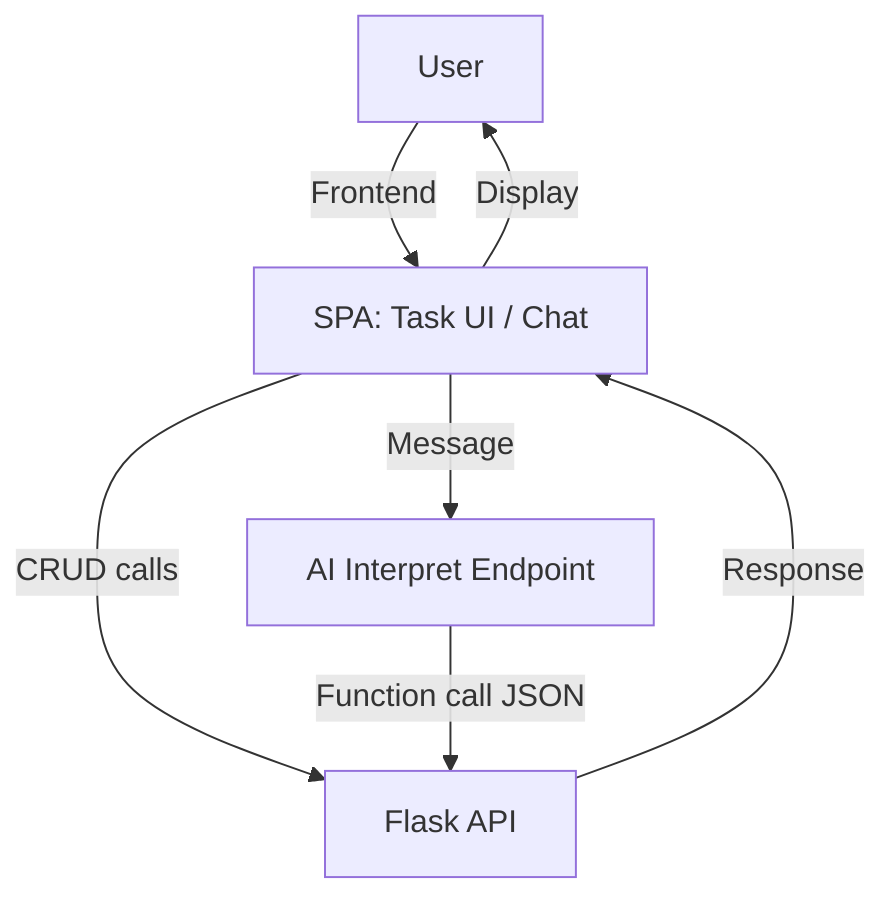
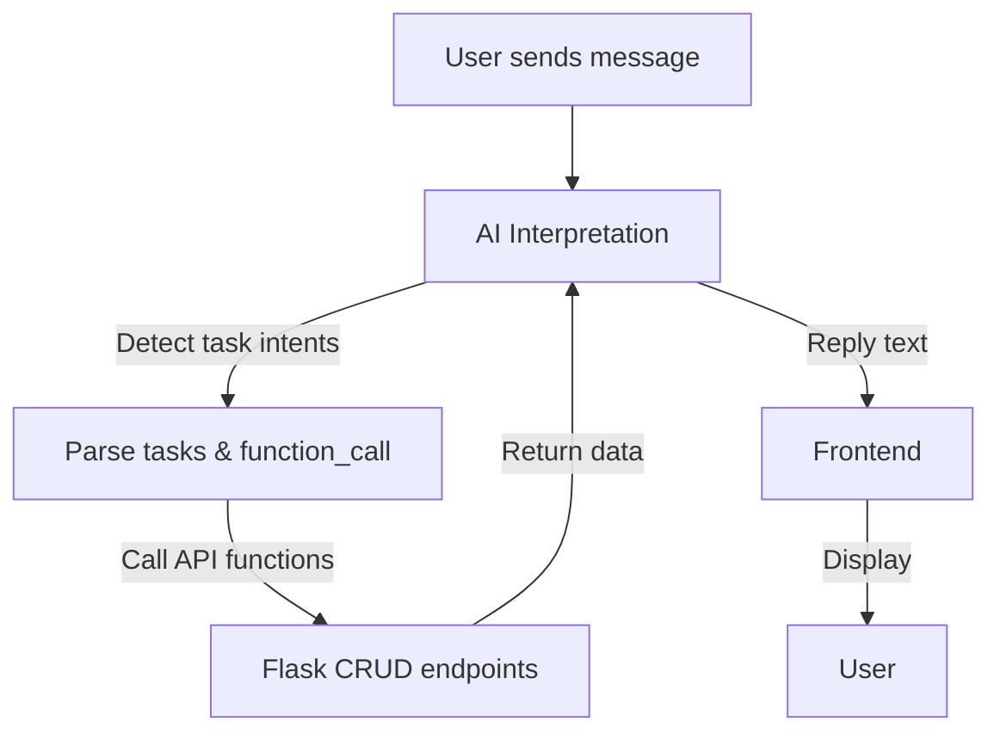

# AI-Powered Task Manager – System Design & Architecture

## 1. Overview

A full-stack To-Do List + AI Chat Assistant application with:

- **Backend**: Flask REST API (CRUD + AI interpret)
- **Frontend**: Single-page web app (Tasks + AI Chat)
- **AI**: GPT-based natural language understanding for task operations

**Goal:** Users can manage tasks using UI or natural language via AI assistant, supporting multiple languages and synonyms.

---

## 2. Backend API Design

### 2.1 Endpoints

| Endpoint             | Method | URL                             | Request Payload                                           | Response                                                                                 |
| -------------------- | ------ | ------------------------------- | --------------------------------------------------------- | ---------------------------------------------------------------------------------------- |
| Create Task          | POST   | `/api/tasks`                    | `{ "description": "<task text>" }`                        | `201 Created` Task object                                                                |
| View All Tasks       | GET    | `/api/tasks`                    | None                                                      | `200 OK` List of tasks                                                                   |
| Update Task          | PUT    | `/api/tasks/<task_id>`          | `{ "description": string, "completed": bool (optional) }` | `200 OK` Updated task object                                                             |
| Complete Task        | POST   | `/api/tasks/<task_id>/complete` | None                                                      | `200 OK` Updated task with `completed=true`                                              |
| Delete Task          | DELETE | `/api/tasks/<task_id>`          | None                                                      | `200 OK` `{ "status": "deleted" }`                                                       |
| AI Interpret Message | POST   | `/api/ai/interpret`             | `{ "message": "<user text>" }`                            | `200 OK` `{ "function_call": [...], "reply": "<AI message>" }`                           |

**Notes:**
- All timestamps in ISO format
- Proper HTTP status codes for success & error
- JSON responses consistent across endpoints

---

### 2.2 API Flow Diagram

---

## 3. Frontend Design Brief

**Layout:**

* **Left Panel:** Tasks

  * Task list with inline edit, complete/delete buttons
  * Sort dropdown + search input
  * Task form at bottom

* **Right Panel:** AI Chat

  * Chat messages with `user` vs `ai` styling
  * Chat form at bottom

**User Interaction Flow:**

1. User adds/edits/deletes/completes task via form or inline UI → updates backend → updates UI
2. User sends natural language message → AI interprets → calls backend functions → replies in chat
3. Task list reflects all AI or UI updates

**Design Principles:**

* Responsive layout (mobile & desktop)
* Accessible ARIA attributes (`aria-live` for dynamic updates)
* Clean, modern gradients & card panels
* Soft shadows and rounded corners for visual hierarchy

---

## 4. Chatbot Function Architecture

### 4.1 Functions

| Function Name  | Parameters                            | Description             |
| -------------- | ------------------------------------- | ----------------------- |
| `addTask`      | `description: string`                 | Add a new task          |
| `viewTasks`    | None                                  | Return all tasks        |
| `completeTask` | `task_id: int`                        | Mark task as completed  |
| `deleteTask`   | `task_id: int`                        | Delete a task           |
| `updateTask`   | `task_id: int`, `description: string` | Update task description |

**Rules:**

* Supports multiple tasks in one message
* Accepts ordinal references (`5th`, `task number 3`, `ke-2`)
* Fuzzy synonyms across languages (add/view/complete/delete/update)

### 4.2 AI Flow Diagram

---

## 5. System Integration

* **Frontend ↔ Backend:** Fetch API, JSON-based
* **AI ↔ Backend:** GPT-generated `function_call` mapped to REST endpoints
* **Error Handling:**

  * Backend returns 400/404 errors for invalid input
  * AI generates friendly messages if task ID invalid or parsing fails

**Cross-Phase Highlights for Grading:**

* RESTful design with consistent responses ✅
* Modern UI/UX with clear components & interaction flow ✅
* AI functions clearly mapped to API endpoints ✅
* Multi-task, multi-language, and ordinal handling ✅
* Robust error handling & fallback messages ✅

---

## 6. Notes

**Phase 1 Grading Coverage:**

* API Design Quality ✅
* UI/UX Design Brief ✅
* Chatbot Function Architecture ✅

**Bonus Criteria Included:**

* Multi-task handling (+3)
* Multi-language synonym handling (+2)
* Ordinal number parsing (+3)